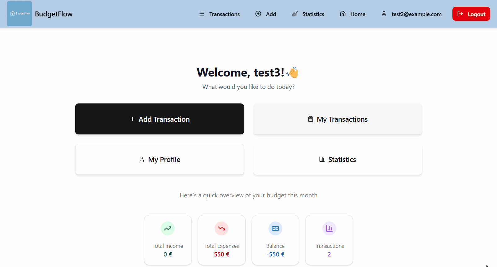

# 💰 BudgetFlow

## 🎥 Demo


**BudgetFlow** is a simple yet complete personal finance tracking application. Users can securely log in, manage their income and expenses, categorize transactions, and filter based on date, category, type, and payment method.

---

## 🚀 Features

- JWT-based authentication (register/login)
- Default `USER` role assignment
- CRUD operations for transactions
- Categorization by:
  - Type (`INCOME`, `EXPENSE`)
  - Category (e.g. `FOOD`, `RENT`)
  - Payment Method (e.g. `CARD`, `CASH`)
- Advanced filtering:
  - Date (`from` / `to`)
  - Type / Category / Method
- Dashboard with:
  - Total Income
  - Total Expenses
  - Balance
- Swagger UI for API testing
- Clean fullstack architecture using a monorepo (backend + frontend)

---

## 🛠️ Technologies Used

### 🔙 Backend
- Java 17
- Spring Boot 3
- Spring Security + JWT
- Spring Data JPA (Hibernate)
- MySQL
- Gradle
- Swagger (SpringDoc OpenAPI)

### 🖥️ Frontend
- React + Vite
- TypeScript
- Tailwind CSS
- ShadCN UI
- React Hook Form + Zod
- Axios

---

## ⚙️ Local Setup

### ✅ Prerequisites

- Java 17+
- Node.js 18+
- MySQL 8+
- Gradle
- Git

---

### 📦 Clone the project

```bash
  git clone https://github.com/katerinasavidaki/BudgetFlow.git
  cd BudgetFlow
```

---

### 🗄️ Setup the database

1. Create a database:
   ```sql
   CREATE DATABASE budgetflowdb;
   ```
   
2. Create a user and grant all privileges:
   ```sql
   CREATE USER 'budgetflowuser'@'localhost' IDENTIFIED BY '12345';
   GRANT ALL PRIVILEGES ON budgetflowdb.* TO 'budgetflowuser'@'localhost';
   ```

---

### 🔧 Backend Setup

```bash
  cd backend
  ./gradlew bootRun
```

- Swagger UI: [http://localhost:8080/swagger-ui.html](http://localhost:8080/swagger-ui.html)

---

### 🖼️ Frontend Setup

1. Navigate to frontend folder, copy the example environment file and create your own `.env` file:
```bash
  cd ../frontend
  cp .env.example .env
```

2. Install dependencies:
```bash
  npm install
  npm run dev
```

- Frontend: [http://localhost:5173](http://localhost:5173)

---

## 📁 Folder Structure

```
BudgetFlow/
├── backend/       → Spring Boot backend
├── frontend/      → React frontend
├── .gitignore
└── README.md
```

---

## 🔐 Environment Variables

```bash
# === Frontend ===
VITE_API_URL=http://localhost:8080/api

# === Backend ===
SPRING_DATASOURCE_URL=jdbc:mysql://localhost:3306/budgetflowdb
SPRING_DATASOURCE_USERNAME=budgetflowuser
SPRING_DATASOURCE_PASSWORD=12345
spring.jpa.hibernate.ddl-auto=update
spring.jpa.properties.hibernate.dialect=org.hibernate.dialect.MySQL8Dialect
JWT_SECRET=your_jwt_secret_key
JWT_EXPIRATION=3600000

```

---

## 🚀 Build for Production (Frontend)

```bash
  npm run build
```

---

## 🙋 About the Author

> Developed with ❤️ by [Katerina Savidaki](https://www.linkedin.com/in/katerina-savidaki/)
